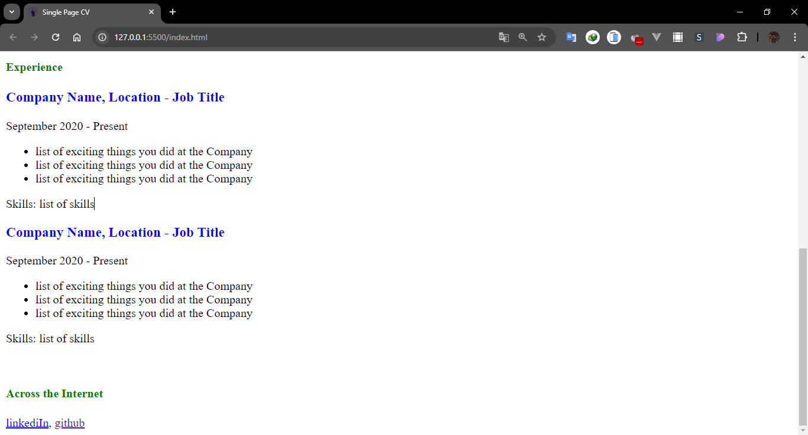

# Single-Page-**CV**

## Petunjuk Penggunaan
 clone repository on local computer using git with command
> `git clone https://github.com/hilariusnahak/Single-Page-CV.git`

Or download the ZIP with:
- click the code button in this repository
  
- Then click Download ZIP
  

After that, open it with your favorite code editor. If you are using VS Code, there are several ways to display this page.
- The first way, using Show Preview in VS Code
  
Result:
  
- The second way, by directly clicking on the file with the extension `.html`
  
  Result:
  
- How to type, using the vscode extension `Live Server`
  
  Right click and select Open with Live Server:
  
  Result:
  
