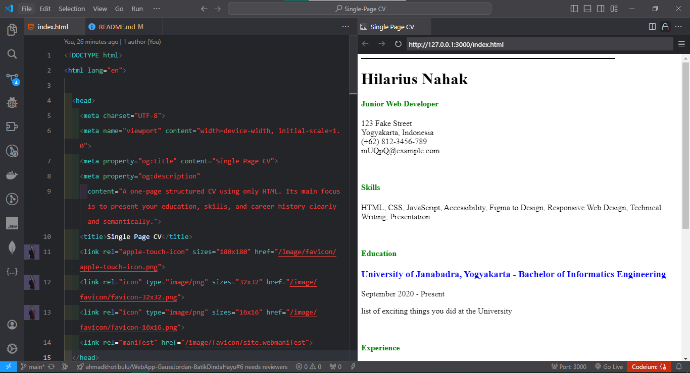
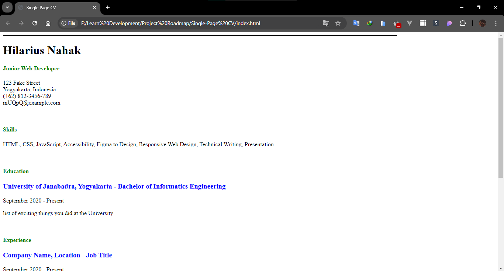
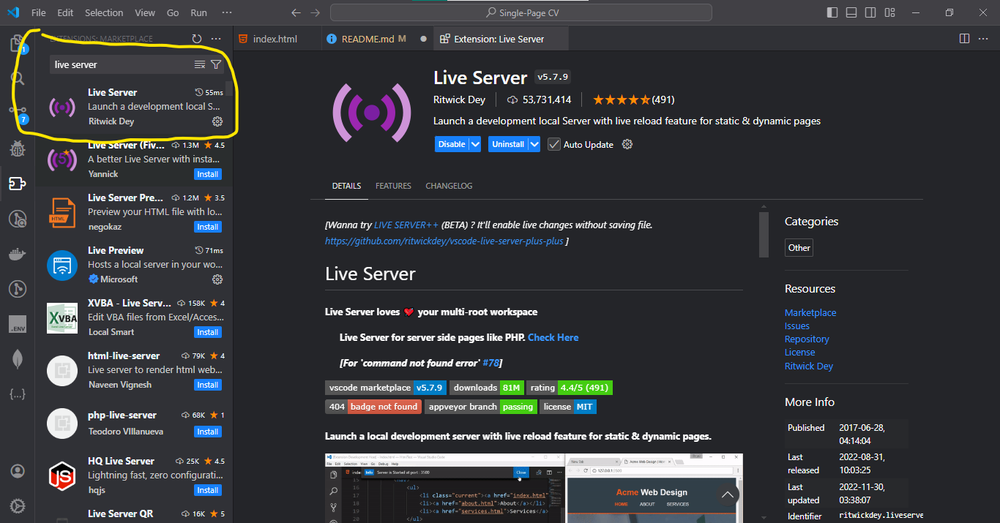

# Single-Page-**CV**

## Petunjuk Penggunaan
 clone repository di lokal komputer menggunakan git dengan perintah
> git clone https://github.com/hilariusnahak/Single-Page-CV.git

Atau download ZIP dengan cara:
- klik button code di repository ini
  
- Kemudian klik Download ZIP
  

Setelah itu buka dengan code editor favorit. Jika Anda menggunakan VS Code maka ada beberapa cara untuk menampilkan halaman ini.
- Cara pertama, menggunakan Show Preview di VS Code
  
Result:
  
- Cara kedua, dengan langsung klik file yang berekstension `.html`
  
  Result:
  
- Cara ketiga, dengan menggunakan extention vs code `Live Server`
  
  Klik Kanan dan pilih Open with Live Server:
  